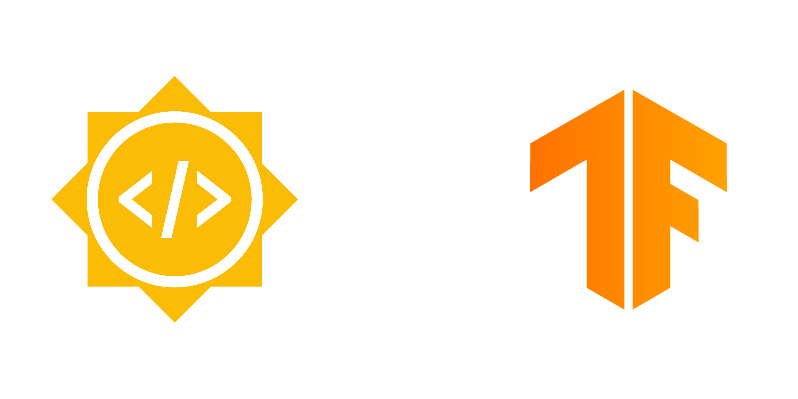

# GSoC Project 2022 - TensorFlow

  

## ⚡Details

* **Year**: 2022
* **Organisation**: [TensorFlow](https://www.tensorflow.org/)
* **Project Title**: [Develop Kaggle examples for TensorFlow Decision Forests](https://summerofcode.withgoogle.com/archive/2022/projects/umFX98b3)
* **Project Description**: Today, many Kaggle competitions are dominated by libraries such as LightGBM and XGBoost, which provide high-performance results on a variety of datasets. TensorFlow Decision Forests (TF-DF) is a collection of state-of-the-art algorithms for the training, serving and interpretation of Decision Forest models. In this project, I have introduced a series of beginner and intermediate examples that demonstrates the use of TensorFlow Decision Forests on various datasets.
* **Mentor**: [Miri B. (Hyman) Raskasky](https://www.linkedin.com/in/miri-b-raskasky-b42969119/)

## 🎯Contributions
| Description | Status |
------------- | --------- |
| [Kaggle example - Intermediate classification](src/kaggle_intermediate_example_classification.ipynb)&nbsp; | Completed |
| [Kaggle example - Beginner classification](src/kaggle_beginner_example_classification.ipynb)&nbsp;  | Completed |
| [Kaggle example - Beginner regression](src/kaggle_beginner_example_regression.ipynb)&nbsp;  | Completed |
| [Kaggle example - Intermediate regression](src/kaggle_intermediate_example_regression.ipynb)&nbsp;  | Completed |

 Contributions apart from my project:
| Link | Description |
| -------------------------------------------------------------------------------------------------------------------------------------------------------------------- | -------------------------------------------------------- |
| [PR #134](https://github.com/tensorflow/decision-forests/pull/134) | Documentation Changes
| [Notebook](https://colab.research.google.com/github/vanshhhhh/Google-Summer-of-Code-2022-TensorFlow/blob/main/src/classification_with_tfdf.ipynb) | [[Non Kaggle example] - Classification with TF-DF](src/classification_with_tfdf.ipynb)&nbsp; |

 

## 😄Acknowledgement

My Google Summer of Code Experience was awesome and a large part of this great experience was the good mentoring of [Miri B. (Hyman) Raskasky](https://www.linkedin.com/in/miri-b-raskasky-b42969119/).

I thank her for the constant guidance, code reviews, timely feedback, help and most importantly, for her dedicated advice and encouragement throughout GSoC. I would love to contribute more to TensorFlow.
  
## 🔗Links

  
